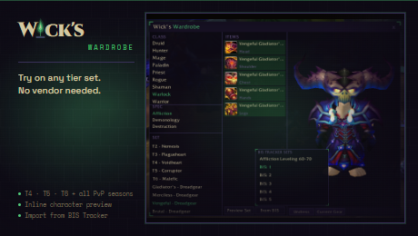

# Wick's Wardrobe

Browse every TBC tier set and weapon on your own character. Click any item to preview it inline -- no vendor required.

## Features

- **All 9 classes** -- T4, T5, T6 + PvP seasons + weapons
- **Inline DressUpModel preview** -- see the gear on your actual character
- **Import from Wick's BIS Tracker** -- preview your full BIS set with one click
- **Save and replay named outfits** -- bookmark looks and reapply them later
- **No vendor required** -- works anywhere, any time

## Usage

`/wwd` -- open the wardrobe browser

## More from Wick

<!-- wick:suite-table:start -->
| Addon | GitHub | CurseForge |
|---|---|---|
| **Wick's TBC BIS Tracker** | [repo](https://github.com/Wicksmods/WickidsTBCBISTracker) | [CurseForge](https://www.curseforge.com/wow/addons/wicks-tbc-bis-tracker) |
| **Wick's CD Tracker** | [repo](https://github.com/Wicksmods/WicksCDTracker) | [CurseForge](https://www.curseforge.com/wow/addons/wicks-cd-tracker) |
| **Wick's Trade Hall** | [repo](https://github.com/Wicksmods/WicksTradeHall) | [CurseForge](https://www.curseforge.com/wow/addons/trade-hall) |
| **Wick's Macro Builder** | [repo](https://github.com/Wicksmods/WicksMacroBuilder) | [CurseForge](https://www.curseforge.com/wow/addons/wicks-macro-builder) |
| **Wick's Combat Log** | [repo](https://github.com/Wicksmods/WicksCombatLog) | [CurseForge](https://www.curseforge.com/wow/addons/wicks-combat-log) |
| **Wick's Stats** | [repo](https://github.com/Wicksmods/WicksStats) | [CurseForge](https://www.curseforge.com/wow/addons/wicks-stats) |
| **Wick's Quest Key** | [repo](https://github.com/Wicksmods/WicksQuestKey) | [CurseForge](https://www.curseforge.com/wow/addons/wicks-quest-key) |
| **Wick's Layers** | [repo](https://github.com/Wicksmods/WicksLayers) | [CurseForge](https://www.curseforge.com/wow/addons/wicks-layers) |
| **Wick's Totems and Things** | [repo](https://github.com/Wicksmods/WicksTotemsAndThings) | [CurseForge](https://www.curseforge.com/wow/addons/wicks-totems-and-things) |
| **Wick's Bags** | [repo](https://github.com/Wicksmods/WicksBags) | [CurseForge](https://www.curseforge.com/wow/addons/wicks-bags) |
| **Wick's Travel Form** | [repo](https://github.com/Wicksmods/WicksTravelForm) | [CurseForge](https://www.curseforge.com/wow/addons/wicks-travel-form) |
| **Wick's Wardrobe** | [repo](https://github.com/Wicksmods/WicksWardrobe) | [CurseForge](https://www.curseforge.com/wow/addons/wicks-wardrobe) |

**Community:** [Discord](https://discord.gg/GWGTMhYBZY)
<!-- wick:suite-table:end -->
